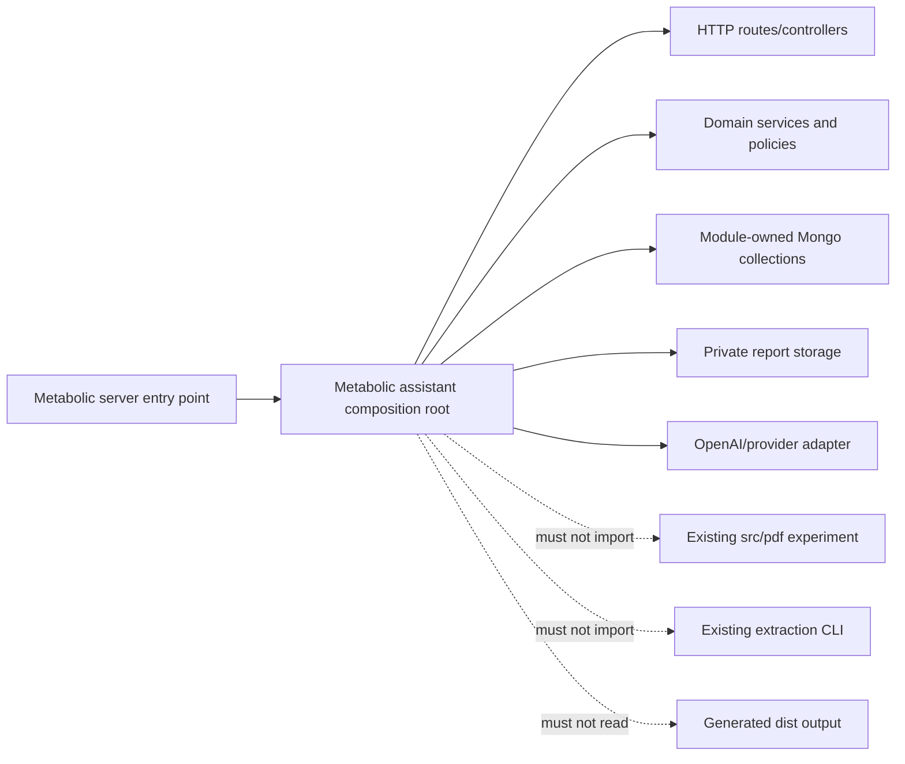
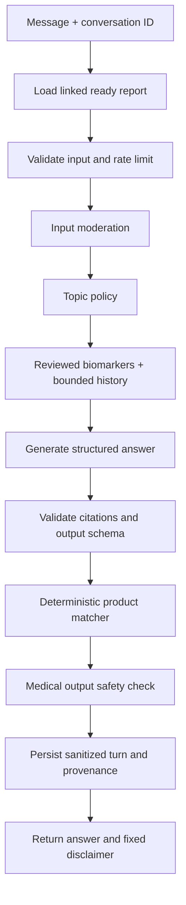

# Isolated Metabolic Assistant — Phase-by-Phase Architecture Plan

**Status:** Planning only  
**Target repository:** `muditam-ai-platform`  
**Prepared:** 2026-07-29  
**Implementation state:** No feature code has been started  
**Initial access model:** Open API without authentication

---

## 1. Objective

Build a new blood-report extraction and metabolic-health assistant inside `muditam-ai-platform` as an isolated application module.

The new module will:

1. Expose open HTTP endpoints without authentication in the initial build.
2. Accept PDF, JPEG, and PNG blood reports.
3. Send report files directly to the new AI-provider adapter.
4. Extract biomarkers into strict, versioned structured data.
5. Allow report results to be reviewed and corrected.
6. Answer report-grounded metabolic-health questions.
7. Recommend only approved Muditam products through deterministic rules.
8. Enforce topic, moderation, medical-safety, and output guardrails.
9. Be independently enabled, disabled, tested, observed, and rolled back.

The existing PDF/OCR experiment is explicitly outside this module and will not be used.

---

## 2. Project Findings That Shape the Plan

This repository is currently a focused TypeScript document-extraction library and CLI:

- Node.js 22 or newer.
- TypeScript with ESM and `NodeNext` module resolution.
- Strict compiler settings, including `noUncheckedIndexedAccess` and `exactOptionalPropertyTypes`.
- Zod 4 for runtime contracts.
- Vitest for automated tests.
- `pdfjs-dist` for the current experimental digital-PDF extractor.
- `src/cli.ts` and `src/index.ts` expose the existing library workflow.
- `src/pdf/*` contains deterministic PDF text/layout extraction.
- `dist/*` is generated build output.
- There is no HTTP application, router, database, object-storage adapter, worker runtime, OpenAI dependency, or environment configuration layer yet.

### Consequences

1. Do not replace or extend `src/pdf/*` for this capability.
2. Do not import `extractPdf`, `src/index.ts`, `src/pdf/*`, or `dist/*` into the new module.
3. Do not route files through the existing PDF.js extraction or its `OCR_REQUIRED` workflow.
4. Do not modify the existing extractor's contracts to hold biomarkers, reports, chats, products, or AI metadata.
5. Preserve TypeScript, ESM, Zod, Vitest, and existing compiler strictness.
6. Add the API as a self-contained module with its own composition root and server entry point.
7. Keep existing CLI and extraction tests operational and behaviorally unchanged.
8. Treat generated `dist` files as build output only; never edit them manually.

---

## 3. Isolation Contract

### Module and API names

```text
Internal module: src/modules/metabolic-assistant
Public API:     /api/v1/metabolic-assistant
```

### Hard boundaries

- All new production feature code lives under `src/modules/metabolic-assistant/`.
- Module-specific tests live under `tests/metabolic-assistant/` to follow the current Vitest convention.
- The module owns its HTTP routes, configuration, contracts, database models, repositories, prompts, policies, workers, and provider adapters.
- The module must not import the current PDF extractor or its schemas.
- The existing extractor must not import the metabolic-assistant module.
- New report data must not be written into the existing extracted-document contract.
- The module must not expose or reuse the current CLI as an API worker.
- The module must not read generated code from `dist`.
- Product matching must not call an external cart or commerce system during the MVP.
- No WebSocket, voice, RAG, fine-tuning, or existing OCR integration is included in the MVP.
- Existing build, typecheck, CLI, and test behavior must continue to pass.

### Allowed shared foundations

The new module may use:

- the repository's TypeScript/ESM conventions;
- the root package manager and build toolchain;
- Zod as a shared validation dependency;
- Vitest as the test runner;
- Node.js standard APIs;
- a process-level MongoDB connection created by the module's runtime composition root.

It may not use existing extraction code as a report-processing dependency.

### Feature flag

```text
ENABLE_METABOLIC_ASSISTANT=false
```

When disabled:

- the HTTP server entry point may start without mounting the module, or the module-specific start command may refuse to initialize cleanly;
- no report-processing worker starts;
- no provider call is made;
- existing library and CLI behavior remains unchanged.

### Dependency direction



---

## 4. Proposed Folder Structure

```text
src/
├── cli.ts                                      # Existing; unchanged
├── index.ts                                    # Existing extractor API; unchanged
├── pdf/                                        # Existing experiment; unused
└── modules/
    └── metabolic-assistant/
        ├── index.ts                            # Public module factory/exports
        ├── server.ts                           # Module-specific process entry point
        ├── README.md                           # Setup, ownership, and runbook
        ├── config/
        │   ├── env.ts                          # Strict module environment schema
        │   └── feature-flags.ts
        ├── constants/
        │   ├── products.ts                     # Approved catalog
        │   ├── biomarker-aliases.ts
        │   ├── disclaimers.ts
        │   └── safety-messages.ts
        ├── contracts/
        │   ├── api.ts
        │   ├── extraction.ts
        │   ├── assistant-output.ts
        │   └── errors.ts
        ├── database/
        │   ├── connect.ts
        │   └── models/
        │       ├── metabolic-report.ts
        │       ├── metabolic-conversation.ts
        │       ├── metabolic-processing-job.ts
        │       └── metabolic-audit-event.ts
        ├── adapters/
        │   ├── openai/
        │   │   ├── client.ts
        │   │   ├── extract-report.ts
        │   │   ├── generate-answer.ts
        │   │   └── moderate.ts
        │   ├── storage/
        │   │   ├── report-storage.ts
        │   │   └── private-object-storage.ts
        │   └── clock.ts
        ├── repositories/
        │   ├── report-repository.ts
        │   ├── conversation-repository.ts
        │   ├── processing-job-repository.ts
        │   └── audit-repository.ts
        ├── services/
        │   ├── report-upload-service.ts
        │   ├── report-extraction-service.ts
        │   ├── biomarker-normalization-service.ts
        │   ├── report-review-service.ts
        │   ├── topic-policy-service.ts
        │   ├── medical-safety-service.ts
        │   ├── product-matching-service.ts
        │   ├── prompt-builder.ts
        │   └── assistant-service.ts
        ├── http/
        │   ├── create-app.ts
        │   ├── routes/
        │   │   ├── health-routes.ts
        │   │   ├── report-routes.ts
        │   │   └── conversation-routes.ts
        │   ├── controllers/
        │   │   ├── report-controller.ts
        │   │   └── conversation-controller.ts
        │   └── middleware/
        │       ├── validate-request.ts
        │       ├── upload-report.ts
        │       ├── rate-limits.ts
        │       └── error-handler.ts
        ├── workers/
        │   ├── report-extraction-worker.ts
        │   └── worker-runtime.ts
        └── observability/
            ├── logger.ts
            └── metrics.ts

tests/
├── extract-pdf.test.ts                         # Existing; unchanged
├── layout.test.ts                              # Existing; unchanged
└── metabolic-assistant/
    ├── unit/
    ├── integration/
    ├── contract/
    ├── fixtures/
    └── evals/

docs/
├── extractor-benchmark.md                      # Existing experiment
└── metabolic-assistant/
    └── PHASED_ARCHITECTURE_PLAN.md
```

The module entry point should expose a factory rather than importing environment state throughout the domain:

```text
createMetabolicAssistantModule(dependencies) -> { app, startWorker, stopWorker }
```

This keeps provider, storage, database, clock, and logger dependencies replaceable in tests.

---

## 5. Technology Direction

The exact package additions occur during implementation, not during this planning step.

### Required capability categories

- HTTP server/router compatible with Node 22 and ESM.
- Multipart file parsing with explicit memory/size limits.
- MongoDB/Mongoose for reports, conversations, jobs, and audit metadata.
- OpenAI SDK for file/image inputs, structured extraction, chat, and moderation.
- Private object-storage SDK or adapter.
- Rate limiting and structured logging.

### Selection rules

- Use TypeScript-native or well-typed packages.
- Confirm ESM support.
- Add dependencies directly to `package.json`; do not rely on transitive packages.
- Keep Zod 4 as the source of runtime request/output validation.
- Centralize SDK initialization inside adapters.
- Do not weaken `tsconfig` strictness to accommodate a package.
- Do not add an OCR package for this module.

### OpenAI direction

- Use a module-owned OpenAI adapter.
- Prefer the Responses API for this new integration.
- Send PDFs as file input and JPEG/PNG reports as image input.
- Use strict Structured Outputs backed by Zod/JSON Schema.
- Configure extraction and chat models independently through environment variables.
- Persist the exact model identifier, schema version, and prompt version for every AI result.
- Explicitly configure provider-side storage behavior.
- Treat refusal, incomplete output, validation failure, rate limits, and timeout as typed outcomes.
- Never allow provider-specific response objects to escape the adapter layer.

Official references:

- [Responses API migration guidance](https://developers.openai.com/api/docs/guides/migrate-to-responses)
- [Structured Outputs](https://developers.openai.com/api/docs/guides/structured-outputs)
- [File inputs](https://developers.openai.com/api/docs/guides/file-inputs)
- [Moderation](https://developers.openai.com/api/docs/guides/moderation)
- [OpenAI API data controls](https://developers.openai.com/api/docs/guides/your-data)

Model names are not frozen in this document. The implementation must select account-available models using representative report and safety evaluations.

---

## 6. API Contract

All initial endpoints are intentionally unauthenticated.

Base path:

```text
/api/v1/metabolic-assistant
```

Success envelope:

```json
{
  "ok": true,
  "data": {},
  "error": null,
  "requestId": "..."
}
```

Error envelope:

```json
{
  "ok": false,
  "data": null,
  "error": {
    "code": "REPORT_NOT_FOUND",
    "message": "Report not found."
  },
  "requestId": "..."
}
```

### Proposed endpoints

| Method | Endpoint | Purpose | Result |
|---|---|---|---|
| `GET` | `/health` | Module liveness/readiness | `200` |
| `POST` | `/reports` | Upload report and enqueue extraction | `202` |
| `GET` | `/reports` | List reports, optionally filtered by `subjectId` | `200` |
| `GET` | `/reports/:reportId` | Read processing status and biomarkers | `200` |
| `PATCH` | `/reports/:reportId/biomarkers` | Confirm or correct extraction | `200` |
| `POST` | `/reports/:reportId/reprocess` | Queue another extraction attempt | `202` |
| `DELETE` | `/reports/:reportId` | Delete report metadata and private file | `204` |
| `POST` | `/conversations` | Start a conversation for one ready report | `201` |
| `GET` | `/conversations/:conversationId` | Read conversation history | `200` |
| `POST` | `/conversations/:conversationId/messages` | Submit message and receive answer | `200` |

### Upload contract

- Content type: `multipart/form-data`
- File field: `report`
- Optional fields: `displayName`, `subjectId`
- Allowed formats: PDF, JPEG, PNG
- Default limit: 10 MB, configurable
- Configurable PDF page limit
- Validate file signature; never trust extension or caller MIME alone
- Reject empty, truncated, encrypted, oversized, and unsupported files with typed errors
- `subjectId` is untrusted correlation metadata, not an identity or ownership claim

### Processing lifecycle

```text
UPLOADED -> QUEUED -> PROCESSING -> NEEDS_REVIEW -> READY
                                \-> FAILED
                                \-> REJECTED
```

Chat accepts only a report in an eligible state.

### Idempotency

Upload, reprocess, conversation creation, and message creation should accept `Idempotency-Key`.

A repeated endpoint request with the same key must not create duplicate:

- reports;
- extraction jobs;
- conversations;
- user or assistant messages.

---

## 7. Module-Owned Data Models

### 7.1 Metabolic Report

Core fields:

- ID
- optional `subjectId` with no authorization meaning
- display name
- status
- private file metadata:
  - object key
  - original filename
  - detected MIME type
  - byte size
  - SHA-256 checksum
  - page count when available
- patient fields only when explicitly present
- laboratory/specimen dates when present
- biomarkers
- extraction provenance
- review metadata
- soft-deletion metadata
- timestamps

Biomarker fields:

- canonical code
- original source label
- numeric value when numeric
- text value when non-numeric
- unit
- printed reference range
- parsed lower/upper bounds when safe
- printed flag
- deterministically derived status
- confidence
- source page
- review state

Extraction provenance:

- extraction schema version
- provider
- exact model
- prompt version
- provider request ID
- start/end timestamps
- warnings
- attempt number

Indexes:

- `{ subjectId: 1, createdAt: -1 }`
- `{ status: 1, createdAt: -1 }`
- checksum index if duplicate detection is enabled

### 7.2 Metabolic Conversation

Core fields:

- ID
- optional `subjectId`
- linked report ID
- status: `active`, `closed`, `blocked`
- bounded messages
- generated conversation summary
- prompt/model provenance
- timestamps

Message fields:

- role
- sanitized content
- safety decision
- cited biomarker IDs
- approved product SKUs
- prompt/model version for assistant output
- timestamp

### 7.3 Processing Job

Core fields:

- report ID
- optional `subjectId`
- type: `extract_report`
- status: `queued`, `leased`, `completed`, `failed`, `dead_letter`
- attempts
- available time
- lease expiry
- safe last-error code
- timestamps

Use an atomic MongoDB lease. Only one worker may own a job at a time. Retry transient errors with bounded backoff; invalid files and schema failures must not loop.

### 7.4 Audit Event

Record:

- action
- target type and ID
- outcome
- request ID
- safe metadata
- timestamp

Never log:

- source report bytes or page images;
- full biomarker payloads;
- full chat messages;
- secrets or access tokens;
- prompts containing medical data;
- provider outputs containing medical data.

---

## 8. Extraction and Normalization Design

### The experimental extractor is not part of this path

For this module:

```text
Uploaded PDF/JPEG/PNG
        |
        v
File validation and private storage
        |
        v
New OpenAI/provider adapter
        |
        v
Strict extraction schema
        |
        v
Deterministic normalization and validation
        |
        v
Reviewable Metabolic Report
```

There is no intermediate call to:

- `extractPdf`;
- PDF.js layout reconstruction;
- current extracted-document schemas;
- OCR flags from the experiment;
- the existing CLI.

### MVP biomarker scope

- HbA1c
- fasting glucose
- post-prandial glucose
- random glucose
- fasting insulin when present
- total cholesterol
- LDL
- HDL
- triglycerides
- vitamin D if required by the approved product catalog

The schema can represent additional markers, but only approved canonical markers receive metabolic/product rules in the MVP.

### Normalization rules

1. Preserve original label, value, unit, reference range, and source page.
2. Store normalized fields alongside source evidence.
3. Never overwrite extracted evidence with a normalized value.
4. Prefer the reference interval printed on the report.
5. Derive `LOW`, `NORMAL`, `HIGH`, `CRITICAL`, or `UNKNOWN` only when deterministic rules permit.
6. Every unit conversion must be explicit, versioned, and tested.
7. Never invent missing values, units, ranges, patient identity, or dates.
8. Mark ambiguous and low-confidence results `NEEDS_REVIEW`.
9. Preserve schema, prompt, model, and rule versions.
10. Reject invalid structured output before database persistence.

---

## 9. Assistant, Safety, and Product Design

### Request pipeline



### Topic policy

Classify messages as:

- `ALLOW`: report interpretation, biomarkers, diabetes/metabolic education, approved product questions.
- `REFUSE_OFF_TOPIC`: unrelated topics.
- `ESCALATE_SAFETY`: symptoms or values covered by an approved urgent-safety policy.

A keyword check may be one signal but must not be the entire topic policy.

### Medical safety

The assistant must not:

- diagnose a condition;
- replace a clinician;
- advise starting/stopping/changing prescription medication;
- promise a cure;
- invent report values;
- give unapproved supplement claims or doses;
- treat missing contraindication data as safe;
- hide uncertainty.

The assistant must:

- distinguish report facts from education;
- include report value and unit when discussing a specific marker;
- state when a value is missing or uncertain;
- use approved escalation messages;
- include a stable application-owned disclaimer;
- advise clinician review according to approved rules.

Medical red flags, thresholds, disclaimer, and escalation copy require qualified medical sign-off before production.

### Deterministic product recommendations

The model must not freely select products.

1. Keep a versioned approved product catalog in the module.
2. Include SKU, approved name, biomarker rules, exclusions, contraindications, approved dosage copy, URL, and active status.
3. Produce eligible candidates using deterministic application code.
4. Let the model explain only eligible candidates.
5. Validate every returned SKU, dosage, URL, and claim.
6. If no candidate is eligible, return education without forcing a product.
7. Test every catalog change.

---

## 10. Initial Open-Access Posture

The initial API intentionally has no authentication:

- no bearer token;
- no API key;
- no OTP/session integration;
- no dependency on the application backend's `User` model;
- no verified ownership.

Callers use returned report and conversation IDs. `subjectId` is optional and untrusted.

Keep future access control replaceable:

- use a neutral request-context type;
- do not spread auth assumptions through domain services;
- use unguessable IDs;
- do not search by phone number or patient name;
- do not expose source-file downloads;
- keep reports in private object storage;
- use de-identified or explicitly approved data during this open stage.

Authentication and user ownership are deferred. They are required before production-sensitive customer reports are exposed over a public network.

### Privacy decisions required before production

- report/chat retention periods;
- user consent and privacy-policy coverage;
- deletion/export behavior;
- regulated-health-data classification;
- vendor/data-processing agreements;
- approved OpenAI data controls;
- provider-file deletion timing;
- operational report access.

---

## 11. Phase-by-Phase Delivery Plan

### Phase 0 — Contract and Safety Freeze

**Goal:** Approve the decisions that define the module.

Deliverables:

- Confirm module name and API namespace.
- Confirm the existing OCR/PDF experiment is excluded.
- Approve MVP biomarkers.
- Approve product catalog fields and responsible stakeholders.
- Approve medical boundaries, escalation rules, and disclaimer.
- Define permitted test-data policy.
- Define report/chat retention and deletion.
- Select private object storage.
- Collect de-identified golden report fixtures.
- Define accuracy, latency, and cost targets.

Exit criteria:

- Engineering, medical, product, privacy, and security stakeholders approve.
- Open-access limitations are documented.
- No unapproved real customer report enters fixtures.

---

### Phase 1 — Isolated TypeScript Module and Runtime Baseline

**Goal:** Establish the new module without report processing.

Planned work:

- Create `src/modules/metabolic-assistant`.
- Add module environment validation.
- Add the module-specific server/composition root.
- Add the feature flag and health endpoint.
- Add request IDs, typed errors, and safe logging.
- Add module test directories and scripts.
- Add only required direct dependencies.
- Preserve existing CLI/library exports.

Exit criteria:

- `npm run typecheck`, `npm test`, and `npm run build` pass.
- Existing extractor tests remain unchanged and pass.
- Module health works when enabled.
- Feature-disabled behavior makes no provider or database calls.
- No import from `src/pdf`, `src/index`, or `dist` exists.

---

### Phase 2 — Module Models, Open Upload API, and Private Storage

**Goal:** Accept files through the open API and create processing jobs.

Planned work:

- Add module-owned Mongo connection/configuration and models.
- Add private storage adapter.
- Validate multipart upload, file signature, byte limit, and PDF page limit.
- Add report create/list/get/delete endpoints.
- Create one job for each accepted report.
- Add idempotency handling.
- Support optional untrusted `subjectId`.
- Clean up partial database/storage writes on failure.

Exit criteria:

- PDF/JPEG/PNG uploads behave according to the API contract.
- Source files are never placed in the repository or a public directory.
- Failed uploads leave no orphaned objects.
- Logs contain no medical file content.
- No current extractor code is invoked.

---

### Phase 3 — Direct Structured AI Extraction

**Goal:** Extract report data without the experimental OCR/PDF pipeline.

Planned work:

- Implement Mongo-backed job leasing and bounded retry.
- Implement direct PDF/image provider input.
- Add strict Zod extraction schema.
- Add extraction prompt version 1.
- Handle provider refusal, invalid output, timeout, and rate limits.
- Persist evidence, confidence, source pages, warnings, and provenance.
- Add deterministic aliases, range parsing, and unit conversion.
- Implement processing status transitions and reprocessing.

Exit criteria:

- No extraction call uses `extractPdf`, PDF.js, the existing CLI, or OCR experiment.
- Golden fixtures meet approved accuracy thresholds.
- Missing/ambiguous data is not invented.
- Invalid provider output is never stored as a ready report.
- Worker crash/retry does not duplicate or lose jobs.

---

### Phase 4 — Review and Correction

**Goal:** Make uncertain extraction visible and correctable.

Planned work:

- Return confidence, evidence, and review state.
- Add a narrow biomarker correction endpoint.
- Preserve original and corrected values.
- Record correction reason and timestamp.
- Prevent chat from using failed/rejected reports.
- Define when manual review is required.

Exit criteria:

- Corrections are auditable.
- Original evidence remains intact.
- Reprocessing does not silently erase corrections.
- Only eligible report states reach assistant context.

---

### Phase 5 — Guardrails and Product Matcher

**Goal:** Implement policy decisions before generative chat.

Planned work:

- Add input limits and rate limits.
- Add moderation adapter.
- Add topic policy.
- Add medical red-flag/escalation policy.
- Add approved product catalog version 1.
- Add deterministic product eligibility/exclusions.
- Add final SKU/dose/URL/claim validator.

Exit criteria:

- Off-topic fixtures are refused before chat generation.
- Safety fixtures use approved escalation behavior.
- Unknown/inactive/excluded products are never returned.
- Missing eligibility information returns no product.
- Prompt injection cannot select another report or alter the catalog.

---

### Phase 6 — Report-Grounded Conversations

**Goal:** Add safe chat over one ready report.

Planned work:

- Add conversation creation linked to one report.
- Load reviewed structured biomarkers, not experimental extractor output.
- Keep bounded recent history plus application-generated summary.
- Generate a strict assistant object containing:
  - answer;
  - cited biomarker IDs;
  - safety classification;
  - eligible product SKUs;
  - escalation flag.
- Validate citations and product references.
- Append disclaimer in application code.
- Persist sanitized messages and provenance.

Exit criteria:

- Report-specific claims map to stored biomarker IDs.
- Product references are constrained to deterministic candidates.
- Diagnosis, medication, and unsafe cases are refused/escalated.
- Cross-report leakage tests pass.
- Provider failures return a stable non-medical fallback.

---

### Phase 7 — Tests, Evals, and Operational Readiness

**Goal:** Prove correctness and non-interference.

Test layers:

- unit tests for contracts, normalization, ranges, topics, medical policies, and products;
- integration tests with disposable MongoDB;
- HTTP contract tests;
- fake storage/provider tests;
- golden extraction evaluations;
- medical-safety and prompt-injection evaluations;
- timeout, retry, idempotency, and worker-lease tests;
- load and rate-limit tests;
- regression tests for the existing extractor and CLI.

Operational deliverables:

- queue, extraction, latency, token, refusal, review, and failure metrics;
- abnormal-spend and abuse alerts;
- kill-switch/runbook;
- job retry/dead-letter runbook;
- report deletion runbook;
- backup/restore verification for module collections.

Exit criteria:

- Typecheck, build, existing tests, module tests, and eval thresholds pass.
- No critical/high security findings remain.
- No report/chat content appears in logs.
- Staging rollback drill succeeds.

---

### Phase 8 — Controlled Open-API Rollout

**Goal:** Release the open API without coupling it to the experimental extractor.

Rollout:

1. Local fake adapters.
2. Staging with de-identified fixtures.
3. Internal callers.
4. Restricted deployment/network access if available.
5. Gradual production traffic only after approval.

Controls:

- feature flag;
- independent upload/extraction/chat rate limits;
- worker concurrency limit;
- daily provider-spend ceiling;
- endpoint kill switch;
- no automatic cart/purchase mutation;
- optional environment/IP controls at the deployment edge, without application auth.

Rollback:

- disable the feature flag;
- stop leasing new jobs;
- preserve queued jobs and data unless explicit deletion is required;
- leave the existing library, CLI, and extractor unaffected.

Exit criteria:

- Accuracy, safety, latency, error rate, and spend stay within targets.
- Existing extractor remains behaviorally unchanged.
- Stakeholders approve the rollout stage.

---

### Deferred Phase 9 — Authentication and Ownership

Authentication is deliberately not part of the initial implementation.

When required later:

- introduce verified principals through the neutral request context;
- scope reports/conversations to the principal;
- add role-based staff access separately;
- prevent cross-user list/read/update/delete operations;
- add access audit events;
- migrate or assign existing open-stage records deliberately.

This phase must not require changes to extraction, normalization, product matching, or assistant domain services.

---

## 12. Environment Variables

Proposed names:

```text
ENABLE_METABOLIC_ASSISTANT=false
METABOLIC_HOST=0.0.0.0
METABOLIC_PORT=
METABOLIC_API_PREFIX=/api/v1/metabolic-assistant
METABOLIC_MONGODB_URI=
METABOLIC_OPENAI_API_KEY=
METABOLIC_EXTRACTION_MODEL=
METABOLIC_CHAT_MODEL=
METABOLIC_OPENAI_STORE=false
METABOLIC_MAX_FILE_BYTES=10485760
METABOLIC_MAX_PDF_PAGES=
METABOLIC_STORAGE_BUCKET=
METABOLIC_STORAGE_PREFIX=metabolic-assistant/reports
METABOLIC_WORKER_ENABLED=false
METABOLIC_WORKER_CONCURRENCY=1
METABOLIC_MAX_JOB_ATTEMPTS=3
METABOLIC_REPORT_RETENTION_DAYS=
METABOLIC_CHAT_RETENTION_DAYS=
METABOLIC_DAILY_SPEND_LIMIT=
```

Use a dedicated OpenAI project/key when possible for isolation, limits, usage visibility, and rotation.

Secrets must come from the deployment secret manager and must never be committed.

---

## 13. Verification Commands

Existing commands remain mandatory:

```bash
npm run typecheck
npm test
npm run build
```

Implementation may add module-specific scripts, for example:

```text
test:metabolic
start:metabolic
worker:metabolic
eval:metabolic
```

Names are finalized during Phase 1. Existing script semantics must not be changed.

---

## 14. Definition of Done

The MVP is complete only when:

- all production feature code is isolated under `src/modules/metabolic-assistant`;
- no new module code imports the existing PDF/OCR experiment;
- the existing CLI, extractor exports, build, and tests remain operational;
- the API is explicitly open and independent of user/auth modules;
- uploaded reports use private storage and approved retention/deletion;
- extraction is strict, evidence-preserving, versioned, and reviewable;
- assistant claims are grounded in reviewed biomarkers;
- product recommendations are deterministically constrained;
- medical rules and copy have qualified sign-off;
- unit, integration, contract, safety, eval, security, and regression checks pass;
- logs contain no report or chat contents;
- disable/rollback behavior is verified.

---

## 15. Explicitly Deferred Beyond the MVP

- Reuse or extension of the current PDF.js/OCR experiment.
- RAG/vector database.
- Fine-tuning.
- Automatic diagnosis or treatment.
- Prescription medication changes.
- Automatic cart creation or purchases.
- Voice/realtime assistant.
- WebSocket streaming.
- Multi-report longitudinal analysis.
- Clinical/staff dashboard.
- User authentication and authorization until Deferred Phase 9.

---

## 16. Implementation Order Summary

```text
Phase 0  Freeze scope, safety, privacy, product, and open-access contracts
Phase 1  Create isolated TypeScript module, server, flag, and test baseline
Phase 2  Add module models, open upload endpoints, jobs, and private storage
Phase 3  Add direct provider-based structured extraction; do not use old OCR/PDF
Phase 4  Add review and correction
Phase 5  Add moderation, topic/medical guardrails, and product matcher
Phase 6  Add report-grounded assistant conversations
Phase 7  Complete tests, evals, observability, security, and runbooks
Phase 8  Roll out the open API behind operational controls
Phase 9  Add authentication and ownership later, without domain rewrites
```

**First implementation step after approval:** complete Phase 0 decisions. Do not begin by extending the current extractor. Start the new implementation only under `src/modules/metabolic-assistant`.
